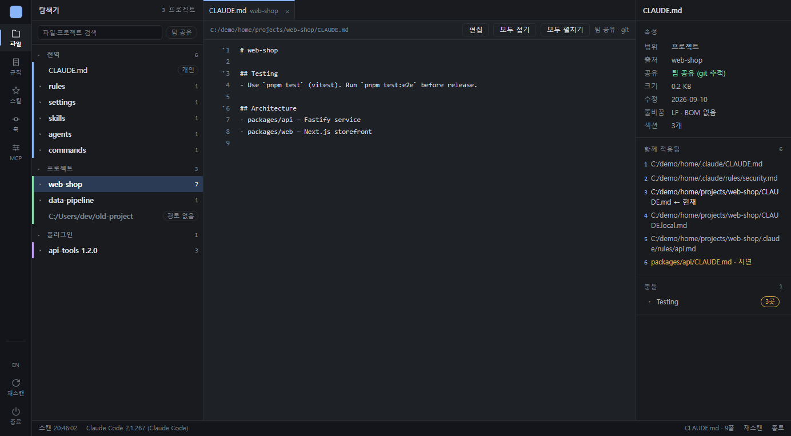
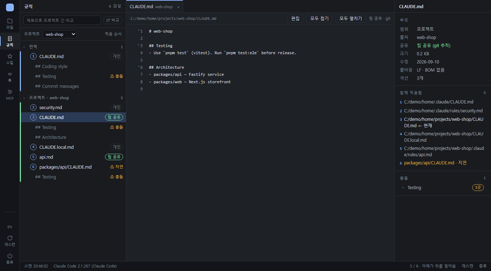
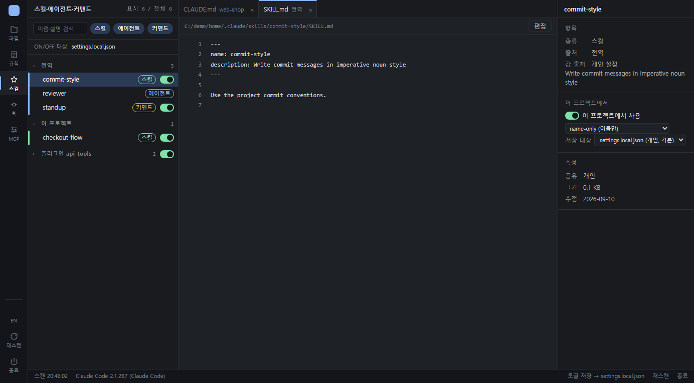
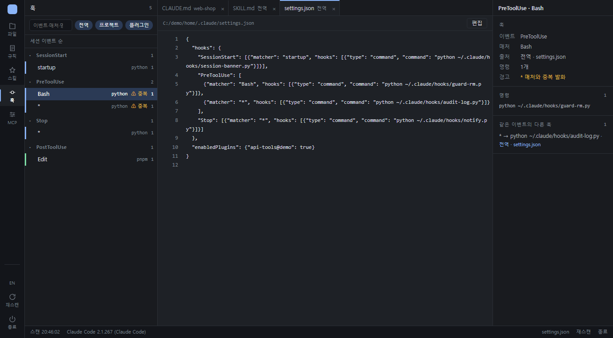
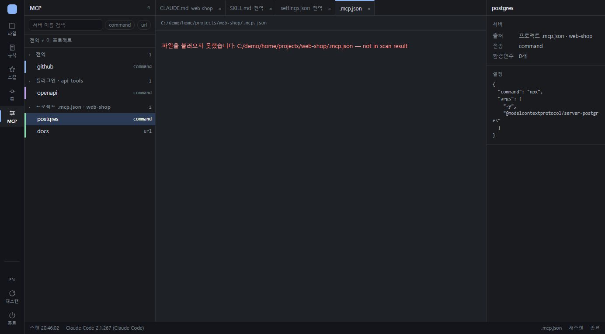
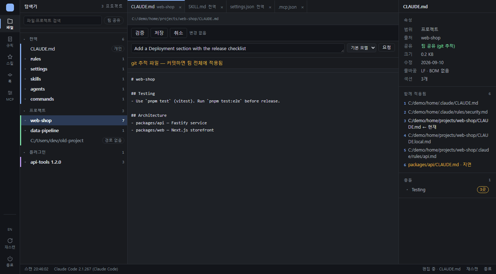
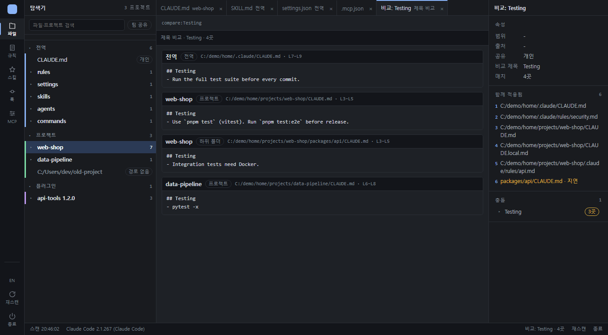

<h1 align="center">claude-config-map</h1>

<p align="center">
  <strong>PC 안에 흩어진 Claude Code 설정을 한 화면에서 보고, 안전하게 고치세요.</strong><br />
  <code>CLAUDE.md</code> · rules · <code>settings.json</code> · 스킬 · 에이전트 · 커맨드 · 훅 · 플러그인 · MCP 서버
</p>

<p align="center">
  <strong>Language:</strong>
  <a href="README.md">English</a> |
  <a href="README.ko.md">한국어</a>
</p>

<p align="center">
  <a href="https://github.com/chajunseok/claude-config-map/tags"></a>
  <a href="LICENSE"></a>
  <a href="https://docs.anthropic.com/en/docs/claude-code/plugins"></a>
  <a href="https://github.com/chajunseok/claude-config-map/stargazers"></a>
</p>

<p align="center">
  
  
  
  
  
</p>

<p align="center">
  <a href="#빠른-시작">빠른 시작</a> · <a href="#기능">기능</a> · <a href="docs/guide.ko.md">사용 가이드</a>
</p>

<p align="center">
  
</p>

## 왜 필요한가

Claude Code 설정은 여러 곳에 나뉘어 있습니다. 전역 `~/.claude/CLAUDE.md` 와 `rules/`, 프로젝트·하위 폴더마다의 `CLAUDE.md`, `settings.json` / `settings.local.json`, `.mcp.json`, 스킬·에이전트·커맨드 폴더, 그리고 플러그인이 끌고 오는 것들까지. 프로젝트와 플러그인이 늘어나면 간단한 질문에도 답하기 어려워집니다.

- **이 프로젝트에서** 실제로 적용되는 `CLAUDE.md` 는 무엇이고, 어떤 순서인가?
- 이 훅은 어디서 왔고, 두 번 실행되지는 않나?
- 같은 섹션이 전역**과** 프로젝트에 둘 다 있나?
- 지금 켜져 있는 스킬·플러그인은 무엇이고, 어느 설정 파일에 저장돼 있나?

**claude-config-map** 은 이 모두를 스캔해 브라우저 한 화면에 IDE처럼 펼치고, 편집·검증·백업·ON/OFF 토글까지 그 자리에서 처리합니다.

## 빠른 시작

> [!IMPORTANT]
> `PATH` 에 **Python 3.11+** 가 있어야 합니다. 플러그인에 Python 은 포함되어 있지 않습니다.

Claude Code 세션에서:

```
/plugin marketplace add chajunseok/claude-config-map
/plugin install config-map@claude-config-map
```

그다음 **새 세션**에서:

```
/config-map
```

브라우저가 `http://127.0.0.1:8765` 로 열립니다. 끝.

<details>
<summary>플러그인 없이 실행</summary>

```bash
git clone https://github.com/chajunseok/claude-config-map.git
cd claude-config-map
python server/web_server.py            # --port 9000, --no-browser
```

</details>

## 기능

| | |
|---|---|
| **적용 규칙 체인**: 프로젝트에서 Claude Code 가 읽는 `CLAUDE.md` 들을 적용 순서대로 보여 주고, 같은 제목 섹션이 여러 곳에 있으면 `⚠ 충돌` 로 표시합니다. |  |
| **스킬·플러그인 토글**: 스킬·커맨드·플러그인 전체를 프로젝트별로 ON/OFF. 고른 개인/팀 설정 파일에 `skillOverrides` / `enabledPlugins` 를 씁니다. |  |
| **훅 한눈에 보기**: 전역·프로젝트·플러그인의 모든 훅을 세션 이벤트 순으로 묶고, `*` 매처 때문에 두 번 실행되면 경고합니다. |  |
| **출처별 MCP 서버**: 전역, 프로젝트 `.mcp.json`, 플러그인 서버를 한 목록에서 보고 각 서버의 설정 JSON 을 확인합니다. |  |
| **안전한 편집**: 저장 전 검증(frontmatter, JSON, 없는 훅 스크립트, 깨진 `@import`), 디스크에서 바뀐 파일 덮어쓰기 거부, 파일당 백업 10개, CRLF/LF·BOM 보존. 섹션 하나만 고치고 나머지는 그대로 둘 수 있습니다. |  |
| **프로젝트 간 비교**: 전역과 모든 프로젝트에서 같은 제목의 섹션을 나란히 봅니다. |  |

그 밖에: 설치된 `claude` CLI 로 수정안을 받아 diff 로 보여 주는 선택형 **편집 도우미**, 한국어/영어 UI, 다크·라이트 테마.

## 안전한 설계

- **로컬 전용.** `127.0.0.1` 에만 바인딩하고, 다른 출처의 요청은 거부하며, 외부로 네트워크 요청을 보내지 않습니다. 텔레메트리 없음.
- **의존성 0.** 서버는 Python 표준 라이브러리, 브라우저는 순수 JS. 빌드 단계·CDN 없음.
- **읽기 우선.** 사용자가 직접 저장·토글한 파일만 쓰고, 쓰기 전에 백업합니다. 플러그인 캐시는 읽기 전용.
- **편집 도우미는 선택.** 도구를 끈 `claude -p` 로 실행되며, 사용할 때만 문서 텍스트가 본인 계정으로 Anthropic 에 전달됩니다.

자세히: [보안](docs/guide.ko.md#보안) · [이 도구가 읽고 쓰는 파일](docs/guide.ko.md#이-도구가-읽고-쓰는-파일)

## 요구사항

- **Python 3.11+** (번들하지 않음. 없으면 `/config-map` 이 안내합니다)
- **Claude Code** 2.1.199+ 권장 (이전 버전도 조회·편집은 됩니다)
- 최신 Chrome / Edge / Firefox
- Claude Code CLI 로그인 (편집 도우미에만 필요)

Windows 11 에서 검증했습니다. macOS·Linux 도 동작할 것으로 보지만 아직 측정하지 않았습니다. 제보 환영합니다.

## 문서

[사용 가이드](docs/guide.ko.md)에 화면 구성, 사이드바별 설명, 검증 규칙(V1–V7), 토글 동작, HTTP API, 문제 해결, 알려진 제한이 정리되어 있습니다.

## 기여

이슈와 PR 환영합니다. 시작은:

```bash
python -m unittest discover -s server/tests
CLAUDE_CONFIG_MAP_HOME=/path/to/fixture-home python server/web_server.py --no-browser --port 8802
```

두 번째 명령은 격리된 홈으로 실행해 실제 설정을 건드리지 않습니다. 프로젝트 구조와 규칙은 [개발](docs/guide.ko.md#개발) 항목을 참고하세요.

이 도구가 설정 파일 뒤지는 시간을 줄여 줬다면, ⭐ 하나가 다른 Claude Code 사용자에게 알리는 데 도움이 됩니다.

<p align="center">
  <a href="https://www.star-history.com/#chajunseok/claude-config-map&Date">
    <picture>
      <source media="(prefers-color-scheme: dark)" srcset="https://api.star-history.com/svg?repos=chajunseok/claude-config-map&type=Date&theme=dark" />
      
    </picture>
  </a>
</p>

## 라이선스

[MIT](LICENSE) © junseok.cha
