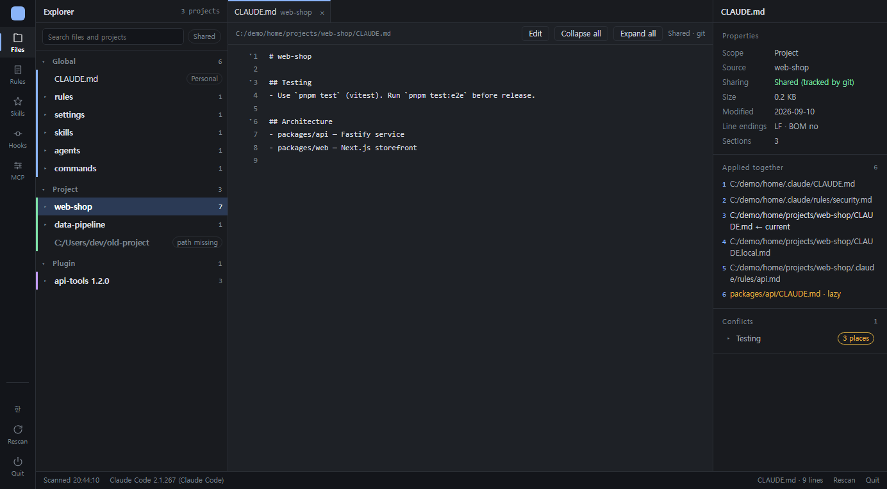
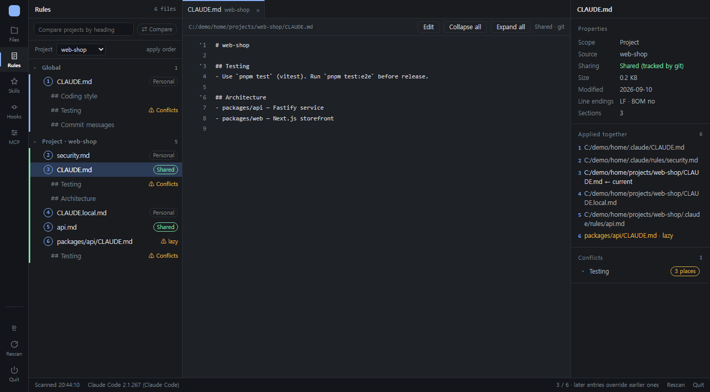
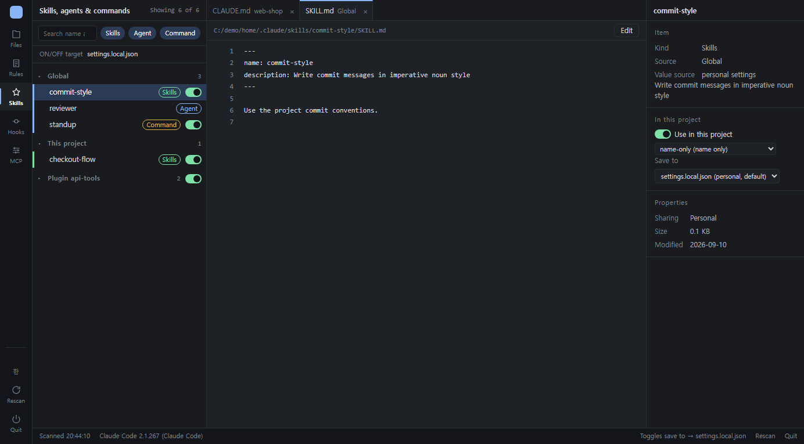
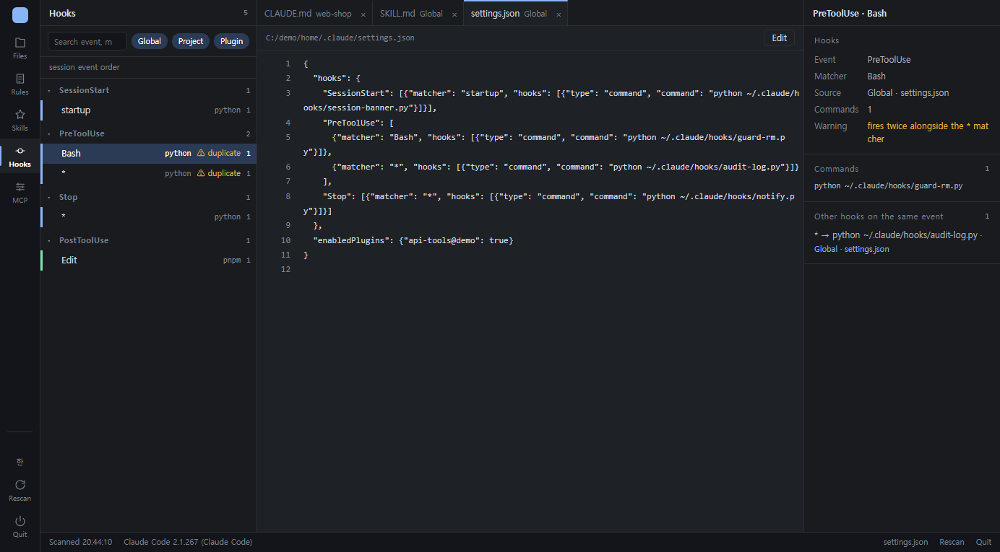
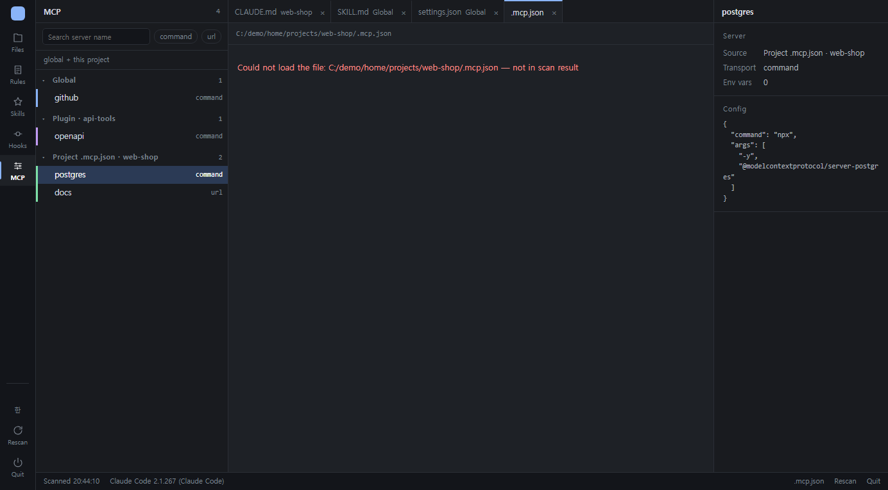
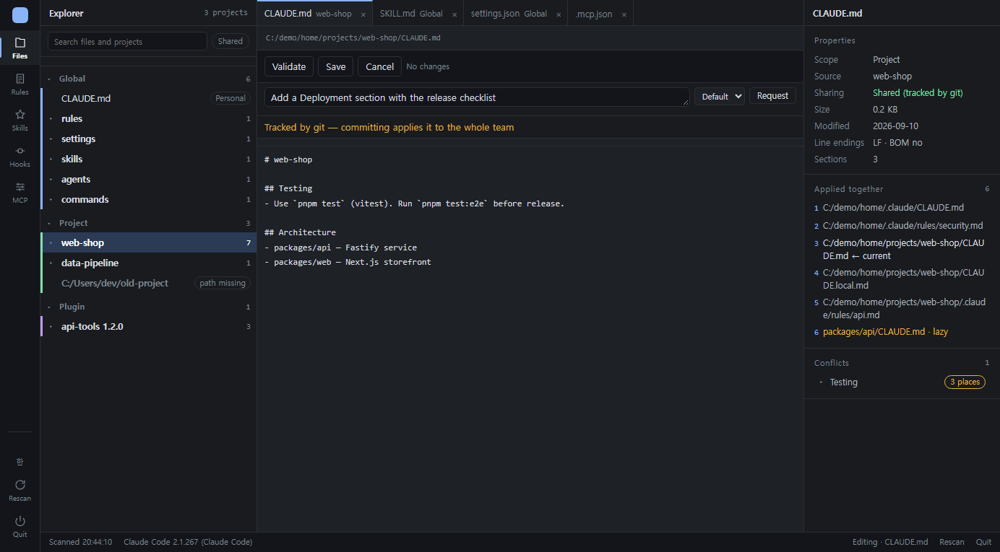
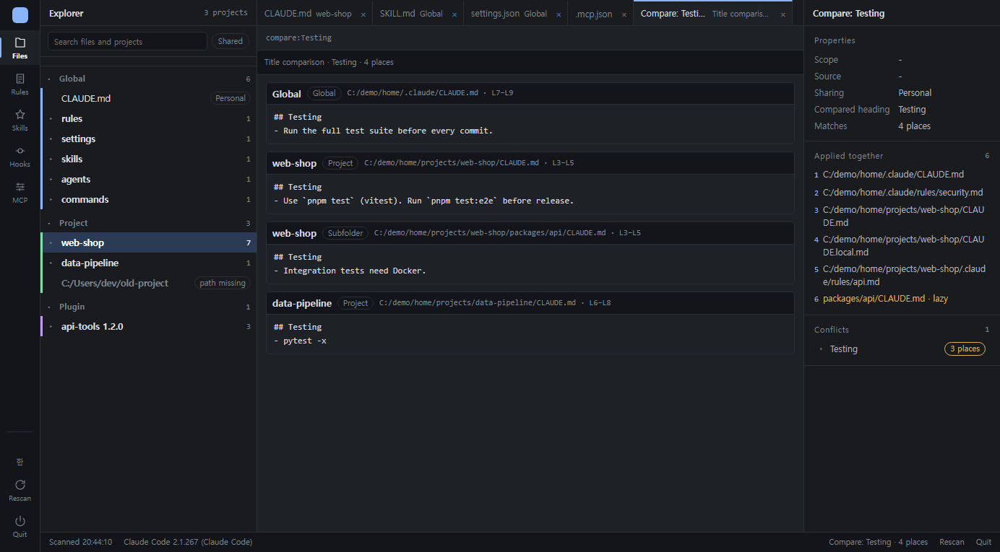

[한국어](README.ko.md)

# claude-config-map

A local tool that puts every Claude Code setting scattered across your PC on one screen, and lets you fix them safely.

Claude Code configuration lives in many places — the global `~/.claude/CLAUDE.md` and `rules/`, each project's `CLAUDE.md`, `.claude/settings.json` and `.mcp.json`, the skills/agents/commands folders, the skills and MCP servers that plugins bring along, and the project list in `~/.claude.json`. Answering questions like "which rules actually apply in this project", "where did this hook come from", or "does the same section title exist both globally and in the project" means opening a pile of files. This tool scans all of it, lays it out IDE-style in one browser screen, and handles editing, validation, backups, and toggles right there.

- Python standard library only. No extra packages to install.
- Local only. It binds to `127.0.0.1` only and rejects requests from outside the browser (Origin mismatch).
- Read-first. It writes only the files you explicitly save or toggle in the UI, and always makes a backup first.



---

## Contents

1. [Install](#install)
2. [Requirements](#requirements)
3. [Running](#running)
4. [Layout](#layout)
5. [The five sidebars](#the-five-sidebars)
6. [Editor](#editor)
7. [Inspector and status bar](#inspector-and-status-bar)
8. [Feature details](#feature-details)
   - [Scan scope and rules](#scan-scope-and-rules)
   - [Edit, validate, save, back up](#edit-validate-save-back-up)
   - [Sections (CLAUDE.md structure)](#sections-claudemd-structure)
   - [Toggles (skills and plugins ON/OFF)](#toggles-skills-and-plugins-onoff)
   - [Edit assistant (Claude CLI)](#edit-assistant-claude-cli)
9. [Files this tool reads and writes](#files-this-tool-reads-and-writes)
10. [Security](#security)
11. [HTTP API](#http-api)
12. [Troubleshooting](#troubleshooting)
13. [Development](#development)
14. [Known limits](#known-limits)

---

## Install

Run two lines in a Claude Code session.

```
/plugin marketplace add chajunseok/claude-config-map
/plugin install config-map@claude-config-map
```

After installing, `/config-map` is recognized in a **new session**. In the same session you may still get "Unknown command".

To update, `uninstall` → `install` is the reliable order. The plugin is unpacked into `~/.claude/plugins/cache/claude-config-map/config-map/<version>/`, and this tool writes nothing into that folder, so your data survives a version change.

## Requirements

| Item | Condition | Notes |
|---|---|---|
| Python | **3.11 or newer (required)** | The plugin does not bundle Python. Without it, `/config-map` only prints the install message and stops. [python.org/downloads](https://www.python.org/downloads/) |
| Claude Code | 2.1.199 or newer recommended | Older versions still view and edit fine. Whether skill toggles (`skillOverrides`) actually take effect depends on the version, and the UI warns when it cannot be confirmed |
| Browser | Recent Chrome / Edge / Firefox | Framework-free vanilla JS. No external CDN or fonts |
| Claude Code CLI login | Only for the edit assistant | Everything else works without the CLI |

## Running

### Slash command

```
/config-map
```

The command looks for the first Python that is 3.11 or newer in the order `python3` → `python` → `py -3`, starts the server in the background, and shows the URL from the first line of stdout (`http://127.0.0.1:8765` by default) in the conversation. It also opens the browser automatically.

### Direct run

```bash
python server/web_server.py                 # 8765, opens the browser
python server/web_server.py --port 9000     # pick a port
python server/web_server.py --no-browser    # print the URL only
```

| Option | Default | Description |
|---|---|---|
| `--port N` | 8765 | If it is taken, the next free port is used automatically |
| `--no-browser` | off | Print the URL without opening a browser |
| `--host` | `127.0.0.1` | For testing. Leaving it alone is recommended |

| Environment variable | Description |
|---|---|
| `CLAUDE_CONFIG_MAP_HOME` | Force the home directory. For isolated testing. If unset, the home is whichever of `Path.home()` → `USERPROFILE` → `HOME` has `.claude.json` |

### Language

The UI follows the browser language: Korean browsers get Korean, everything else gets English. You can switch it with the language button at the bottom of the activity bar (it reads `EN` while the UI is in Korean, and shows the Korean label while it is in English), and the choice is remembered in the browser.

### Single instance

The server records `{port, pid, url}` in `~/.claude/config-map/server.json`. On a second run it sends `/api/ping` to that URL, and if the old server is alive it **just opens the existing URL and exits**. If the record is dead, it starts a new one. To stop it, use the UI's `Quit` button (status bar or bottom of the activity bar), which also clears the record.

While editing (unsaved changes), quitting and rescanning ask for confirmation.

---

## Layout


```
┌────┬──────────────┬──────────────────────────────┬──────────────┐
│ Ac │ Sidebar      │ Editor                       │ Inspector    │
│ ti │ header (n)   │ tab row (open files, max 6)  │ header       │
│ vi │ toolbar      │ path row + edit/fold buttons │ sections for │
│ ty │ context row  │ numbered source / edit mode /│ the selection│
│ ba │ group header │ compare tab                  │              │
│ r  │ 28px rows …  │                              │              │
├────┼──────────────┴──────────────────────────────┴──────────────┤
│    │ Status bar: scan time · Claude Code version · N errors · [state] · Rescan · Quit │
└────┴────────────────────────────────────────────────────────────┘
  56px      300px                  1fr                     272px
```

- **Activity bar** (56px, left) — five icons change the **sidebar content**: Files · Rules · Skills · Hooks · MCP. The selection is a 2px blue indicator on the left. Rescan and Quit icons sit at the bottom. Changing the sidebar leaves the editor alone — you can browse lists while editing.
- **Sidebar** (300px) — all five share the same four-layer shape: header → toolbar (search + filter chips) → context row → group header → 28px rows. The 3px color stripe on the left of a row is its origin (**blue global · green project · purple plugin**). The meta on the right of a row is one tag or one number, and a warning is one short fragment like `⚠ lazy`. Scroll position and focused row survive a re-render.
- **Editor** (center) — whatever you click in whichever sidebar, the file opens here as a tab.
- **Inspector** (272px) — shows only the sections about **what you selected**. With nothing selected, one line of guidance.
- **Status bar** (28px, bottom) — scan time, Claude Code version (warning color if unconfirmed), error count (click for the list at the top of the inspector), a one-line state of whatever you are looking at on the right, and the Rescan / Quit buttons.
- Dark by default, light if the OS theme is light. Below 900px the inspector moves under the editor.

## The five sidebars

### Files (explorer)

A file tree of three groups: global · project · plugin.

- **Global** — `~/.claude/CLAUDE.md`, `rules/*.md`, `settings.json` and `settings.local.json`, `skills/`, `agents/`, `commands/`.
- **Project** — each project registered in `~/.claude.json`. Root `CLAUDE.md` and `CLAUDE.local.md`, subfolder `CLAUDE.md` (`⚠ lazy` = loaded only when you work in that folder), `.claude/rules`, `settings`, `skills`, `agents`, `commands`.
- **Plugin** — based on `installed_plugins.json`. `plugin.json`, skills, commands. Disabled plugins are dimmed with an `OFF` tag.

Row rules: a file row carries one tag, `personal` or `team-shared` (whether git tracks it; `*.local.*` stays personal even when tracked). Folder and project rows show the number of files under them. Clicking a project name selects it and expands its collapsed children (the arrow closes them). Projects whose path is gone are dimmed with `path missing`.

Toolbar: `Search files and projects` (substring match on name and path; only matching rows and their ancestors remain, folding ignored), and the `Shared` chip (git-tracked files only).

### Rules (effective chain)

Pick a project in the Files sidebar and this shows **the CLAUDE.md-family files Claude Code actually reads in that project, in the order they apply**. The numbered circle is the order, and later entries override earlier ones.

- Groups: `Global` / `Project · <name>`.
- Headings of `##` or deeper hang under the file row as indented child rows. Click one and the editor jumps to that line and highlights it briefly. If the same title exists globally and in the project, you get `⚠ conflict`.
- The context row lets you switch projects directly.
- Type a title into the toolbar search box and press Enter (or the `⇄ compare` chip) to open a **cross-project compare tab**. See [Sections](#sections-claudemd-structure) below.



### Skills, agents, commands

Groups for global · this project · each plugin. A row is a name + a kind tag (`skill` / `agent` / `command`) + an ON/OFF switch.

- Toolbar: `Search name and description` (includes the frontmatter `description`), plus three kind chips.
- The switch to the right of a plugin group header is a **per-plugin** ON/OFF.
- The context row shows which file the toggle saves to.



### Hooks

The hooks in `settings*.json`, grouped **in session event order** (SessionStart → … → Stop). A row shows the matcher name (`(all)` when there is none), the file name of the first command (mono), and the command count. If it fires twice together with a `*` matcher, `⚠ duplicate`. The color stripe is the origin (global / project / plugin).

- Toolbar: `Search event, matcher, command`, plus three origin chips (all ON by default).
- Clicking a row opens the origin `settings.json` in the editor and shows hook details in the inspector. Plugin-origin hooks have no file to open.



### MCP

Grouped by origin (global `settings.json` / project `.mcp.json` / plugin). A row shows the server name and the transport (`command` / `url` / `no config`). If a project is selected, only that project's `.mcp.json`; otherwise all projects.

- Toolbar: `Search server name`, plus `command` / `url` chips (both off = all).
- Clicking opens the source file and shows only that server's config JSON in the inspector.



## Editor

- **Tabs** — the last 6. When several tabs share a name and origin (`SKILL.md` and friends), they are shown as `folder/SKILL.md`. Tabs for files that disappeared after a rescan are closed.
- **Path row** — the full path plus buttons on the right: `Edit`, `Collapse all`, `Expand all`, and `Shared · git` for shared files. Files owned by a plugin show `Read-only (plugin)`.
- **Source view** — line numbers plus body. A fold toggle sits in the line-number column of heading lines. Everything past line 2,000 is shown as one block.
- **Edit mode** — a `Validate` `Save` `Cancel` toolbar (each with a tooltip), the edit-assistant prompt box, a textarea, and the validation result list. `Ctrl+S` saves. For team-shared files there is a "committing this applies it to the whole team" warning row. Closing the tab or the browser with unsaved changes asks for confirmation.
- **Compare tab** — a `Compare: <title>` virtual tab. Read-only. Click a card header to jump to that line in that file.



## Inspector and status bar

The inspector shows only these sections, depending on what is selected.

| Selection | Sections |
|---|---|
| File | `Properties` (scope · origin · sharing · size · modified · line endings · BOM · section count) → `Applied together` (N) → `Conflicts` (N) |
| Skill / agent / command | `Item` (kind · origin · description · value source) → `In this project` (switch · scope · save target · warnings) → `Properties` |
| Hook | `Hook` (event · matcher · origin · command count) → `Commands` → `Other hooks on the same event` |
| MCP server | `Server` (origin · transport · env var count) → `Config` (JSON) |
| Project only | `Project` (path · scan scope · completeness · git · toggle count) → `Applied together` → `Conflicts` → `Hooks in this project` |
| Compare tab | `Properties` (compared title · match count) |

The text on the right of the status bar changes per view: `CLAUDE.md · 15 lines`, `editing · CLAUDE.md`, `3 / 5 · later overrides earlier` (rules), `toggle saves → settings.local.json` (skills); for hooks and MCP it is the origin file name.

---

## Feature details

### Scan scope and rules

- **The project list** is the `projects` key of `~/.claude.json`. Paths that differ only in spelling, like `C:/x` and `c:/x`, are merged into one.
- **CLAUDE.md discovery** walks up to depth 8 from the project root and skips these folders: `node_modules` `.git` `dist` `build` `target` `.venv` `venv` `__pycache__` `.next` `.nuxt` `out` `coverage`. Past 20,000 directories it stops and marks the project `partially scanned`.
- **Root-only scan** (`⚠ root only`) happens for: the home directory itself, a drive root, and a parent folder of another registered project. This avoids walking huge trees.
- **Team-shared status** is decided by `git ls-files` (once per project, 8 in parallel). Without git, or outside a repository, everything is personal.
- **The effective chain** (Rules sidebar and `Applied together`) is global `CLAUDE.md` → global `rules/*.md` → project root `CLAUDE.md` → `CLAUDE.local.md` → subfolder `CLAUDE.md` (lazy). `@path` imports are checked as links only, never expanded inline.
- **Hooks** are collected from global and project `settings.json` / `settings.local.json` and from plugin manifests.
- **The Claude Code version** comes from `claude --version`. On failure it shows `version unconfirmed` and raises the toggle warning.
- Scan errors (read failures, JSON parse failures, and so on) do not stop the scan; they collect under `N errors` in the status bar.

### Edit, validate, save, back up

`Validate` checks the current textarea content against the rules **without saving**. `Save` runs the same check automatically and writes only when there are no errors. Warnings do not block saving.

| Rule | Level | Target | Content |
|---|---|---|---|
| V1 | error | `*.json` | JSON parse failure (with line number), top level is not an object |
| V2 | error | `SKILL.md` · `agents/*.md` · `commands/*.md` | missing required frontmatter keys `name` and `description` |
| V3 | error | `settings*.json` | the script path in a hook `command` does not exist. Paths containing environment variables are skipped, and nothing is executed |
| V4 | error | markdown | the target of an `@path` import or a relative link does not exist |
| V5 | warning | effective chain | sections with the same title in several files (shown as `Conflicts` in the Rules sidebar and the inspector) |
| V6 | warning | `settings*.json` | a `*` matcher and a specific matcher coexist on the same event → duplicate firing |
| V7 | — | every save | if the file on disk changed after it was read, the save is refused (409) and `Reload` is required |

Save behavior:

- Before writing, the original bytes are copied to `~/.claude/config-map/backups/<first 16 chars of the path sha1>/<UTC timestamp>.bak`, keeping only the **10** most recent per file.
- The content is written to a temp file and swapped in atomically. The original line endings (CRLF/LF) and BOM presence are remembered at read time and restored on write.
- Request bodies are capped at 1 MiB.
- Files inside the plugin cache and paths outside the scan scope are refused (403).

### Sections (CLAUDE.md structure)

Files are sliced by markdown headings (`#`–`######`). A `#` inside a fenced code block (``` / ~~~) is not a heading, and everything before the first heading is the preamble. Setext headings (`===` / `---` underlines) are not recognized.

- **Folding** — the toggle in the heading's line-number column, or `Collapse all / Expand all` in the path row. Fold state survives saving, reloading, and rescanning.
- **Editing one section** — `Edit this section` appears when you hover a heading line. Only that section's lines go into the textarea, and saving swaps just that line range, so the remaining lines stay byte-identical. Validation runs against the synthesized whole document. If the disk changed mid-save (V7), the file is re-read, the range is found again by the same title, and if it cannot be found the editor falls back to whole-file editing.
- **Conflicts (V5)** — `⚠ conflict` on a section row in the Rules sidebar, and the inspector's `Conflicts` section expands each file's body side by side.
- **Cross-project compare** — sections whose titles match **exactly** are collected from the global config and every project into a compare tab.



### Toggles (skills and plugins ON/OFF)

The UI writes Claude Code's `skillOverrides` and `enabledPlugins` settings.

- **Skills and commands** — the switch (ON/OFF) on a Skills sidebar row, or open the item and use the four-step select under the inspector's `In this project`: `on` (no restriction) · `name-only` · `user-invocable-only` · `off`. Agents are not toggleable.
- **Plugins** — the switch on the sidebar group header. Individual skills inside a plugin cannot be turned off separately (per-plugin only).
- **Save target** — by default the selected project's `.claude/settings.local.json` (personal). The inspector can switch it to `.claude/settings.json` (team-shared), which raises the "committing this applies it to the whole team" warning.
- **Value source** badge — where the current value came from: `global settings` / `team settings` / `personal settings`. Without one, it is the default. The merge order is global → team → personal.
- If the file does not exist it is created. If it does, the JSON is **re-serialized**, so indentation, key order, and other formatting of the original may change. Returning to the default deletes the key, and empty sections are removed. Backups follow the same rules as editing.
- Toggles are reflected in place without a rescan. To toggle anything you must first select a project in the Files sidebar; global toggles are not supported.

### Edit assistant (Claude CLI)

Write an instruction in the prompt box under the edit-mode toolbar (whole file or section) and the server calls your **installed Claude Code CLI** to fetch a revision.

- The call is `claude -p --tools "" --output-format json --no-session-persistence`. **Tools are empty**, blocking file access and command execution, and the document body plus the instruction are passed only through stdin. It uses your logged-in subscription, so no API key is needed.
- The server neither reads nor writes files in this feature. The body is exactly what is in the on-screen textarea.
- Enter sends, Shift+Enter inserts a newline. Models are `default / sonnet / opus / haiku`. While running you see the elapsed seconds and `Cancel`.
- The result is shown first as a **unified diff preview**. `Apply` puts it into the textarea, and saving goes through the usual validation and backup flow. `Discard` changes nothing. The status line shows the cost per call (USD).
- The working directory is `~/.claude/config-map/` so that project CLAUDE.md files do not get dragged into the prompt. The global `~/.claude/CLAUDE.md` is always read by the CLI, so it counts toward the cost.
- Timeout 180 seconds, 3 concurrent runs. Without the CLI you only get an informational message, and everything else keeps working.

---

## Files this tool reads and writes

**Reads** (scan)

- `~/.claude.json` — project list, global MCP servers
- `~/.claude/CLAUDE.md`, `~/.claude/rules/*.md`, `~/.claude/settings.json`, `~/.claude/settings.local.json`
- `~/.claude/skills/**`, `~/.claude/agents/*.md`, `~/.claude/commands/*.md`
- `~/.claude/plugins/installed_plugins.json` and each plugin cache's `plugin.json`, skills, and commands
- Each project's `CLAUDE.md`, `CLAUDE.local.md`, subfolder `CLAUDE.md`, `.claude/**`, `.mcp.json`
- The output of `claude --version` and `git ls-files`

**Writes**

- Files you saved in the UI (in place)
- The selected project's `.claude/settings.local.json` or `.claude/settings.json` that toggles write to (created if missing)
- `~/.claude/config-map/backups/…` — pre-write backups of the files above
- `~/.claude/config-map/server.json` — running server info (deleted on quit)

Nothing else is written. In particular, nothing is ever written into the plugin cache (`~/.claude/plugins/cache/...`) — that path is replaced wholesale on update.

## Security

- Binds to `127.0.0.1` only. Other users on the same PC and anything on the network cannot reach it.
- Every POST is accepted only when the `Origin` header is the server's own address (`http://127.0.0.1:<port>` or `localhost`). This stops another site from using your browser to save, toggle, or quit.
- Request bodies are capped at 1 MiB. Save targets are limited to paths inside the scan scope, and the plugin cache is read-only.
- The UI inserts all text with `textContent` only (no innerHTML). Config file content has no way to run as script.
- The edit assistant's CLI call runs without tools (`--tools ""`) and leaves no session (`--no-session-persistence`).
- The hook script path check (V3) only confirms existence; it never executes anything.

## HTTP API

The endpoints the UI uses. All of them are `127.0.0.1` local only, and POSTs go through the Origin check.

| Method | Path | Description |
|---|---|---|
| GET | `/` | UI |
| GET | `/ui/<path>` | static files (`.css` / `.js` only, `no-store`) |
| GET | `/api/ping` | `{ok, pid, version}` |
| GET | `/api/scan` | full scan result (a fresh scan on every call) |
| GET | `/api/file?path=` | file source + meta (size, mtime, CRLF, BOM, sections) |
| GET | `/api/rules?project=` | effective chain + section conflicts |
| GET | `/api/effective?project=` | effective chain (old format) |
| GET | `/api/sections?path=` | section list |
| GET | `/api/compare?title=` | cross-project comparison of same-title sections |
| POST | `/api/validate` | `{path, text}` → `{issues}` |
| POST | `/api/save` | `{path, text, expected_mtime}` → save (with backup) |
| POST | `/api/save-range` | `{path, start, end, text, expected_mtime}` → replace a line range |
| POST | `/api/toggle` | `{project, section, key, value, target}` → update `skillOverrides` / `enabledPlugins` |
| POST | `/api/assist` | `{path, text, instruction, range?, model?}` → 202 `{id}` |
| GET | `/api/assist?id=` | job status `{status, result?, diff?, changed?, error?, cost_usd?}` |
| POST | `/api/assist-cancel` | `{id}` → stop a running job |
| POST | `/api/shutdown` | stop the server |

Status codes: `400` field error · `403` Origin mismatch or disallowed path · `404` not found · `409` disk changed (V7) · `413` body too large · `422` save refused on validation errors · `429` too many concurrent assistant runs · `503` no Claude CLI.

## Troubleshooting

| Symptom | Cause · fix |
|---|---|
| `/config-map` → `Unknown command` | Same session as the install. Open a new session |
| Only the Python install message appears | No Python 3.11+ on PATH. The Windows Store's fake `python` alias is filtered out. Install it, then use a new terminal |
| The browser shows an old screen | You reinstalled the plugin but the old server is still alive. Use the UI's `Quit` and run `/config-map` again, or hard-refresh |
| A save is blocked with `409` | Another program changed the file after it was read. `Reload`, then edit again |
| A save is blocked with `422` | Validation errors (V1–V4). Fix them using the line numbers in the list. Warnings (V5, V6) do not block saving |
| A project shows `root only` | Home, a drive root, or a parent folder of another project. Subfolder CLAUDE.md files are not scanned |
| A project shows `partially scanned` | Over the 20,000 directory cap. Move it under an excluded folder, or register the subprojects separately |
| `Claude Code version unconfirmed` | `claude --version` failed. Toggles still work, but whether they actually apply cannot be guaranteed |
| Edit assistant `claude CLI not found` | The Claude Code CLI is not on PATH. Install it, log in, then restart the server |
| The edit assistant adds explanations around the body | Check the diff preview and press `Discard`. Make the instruction more specific |
| Korean text is garbled in a Windows console | A cp949 console issue. Files and the UI are fine in UTF-8 |

## Development

```
server/
  web_server.py   HTTP server and routing (ThreadingHTTPServer, standard library)
  core.py         facade — re-exports the four modules below
  common.py       shared helpers, constants, error collection, frontmatter parser
  scan.py         F1/F2 scan (projects, plugins, hooks, MCP, effective chain)
  edit.py         F4 validation · F5 save/backup · F7 toggles
  sections.py     F8 section parsing, conflicts, comparison, range replacement
  assist.py       F9 edit assistant (Claude CLI call)
  ui/
    index.html    markup
    app.css       styles (dark by default · light override)
    js/i18n.js    Korean-keyed dictionary + `t()` / `tMsg()` (loaded before core.js)
    js/core.js    state (S), helpers, shared parts (rows, groups, tags, switches, icons)
    js/sidebar.js activity bar + the five sidebars
    js/editor.js  tabs, source, folding, editing, comparison, edit assistant
    js/inspector.js inspector and toggle reflection
    js/main.js    scan loading, status bar, quit, boot
  tests/          unittest (isolated homes via FakeHome in helpers.py)
commands/config-map.md   slash command
.claude-plugin/plugin.json
```

Tests:

```bash
python -m unittest discover -s server/tests
```

Run the server against an isolated home so your real config is untouched:

```bash
CLAUDE_CONFIG_MAP_HOME=/path/to/fixture-home python server/web_server.py --no-browser --port 8802
```

Principles:

- Standard library only. The frontend is vanilla JS with no framework and no build step, and the DOM is `textContent` only.
- UI strings go through `t()`; `server/ui/js/i18n.js` holds one Korean-keyed dictionary (the Korean source text is the key, so Korean mode is lossless) plus `tMsg()` for the Korean messages the server produces.
- Async responses are guarded by generation numbers (`sseq` / `fseq` / `eseq`) so late arrivals are dropped.
- Branching: feature branch off `develop` → `--no-ff` merge → tag (`vX.Y.Z`) → delete the branch. The version lives in two places, `plugin.json` and `VERSION` in `web_server.py`.

## Known limits

- The only verified OS is Windows 11 (47 projects: first scan 3.4–4.6 s, rescan 2.7–2.9 s, measured 2026-09-10). macOS and Linux should work given the path handling, but were not measured.
- There is no hook form editor. Editing `settings.json` directly plus the V3 and V6 checks stands in for it.
- There is no section deletion or reordering. Fix it directly in edit mode.
- There is no MCP tool (the direction where Claude calls this tool).
- `@import` is only checked for existence, never expanded. Setext headings are not treated as sections.
- Whether a skill toggle actually applies depends on the Claude Code version. This tool only writes the settings file.
- On Windows, part of `test_web_server` fails intermittently on socket shutdown timing (WinError 10053). Rerunning passes.
