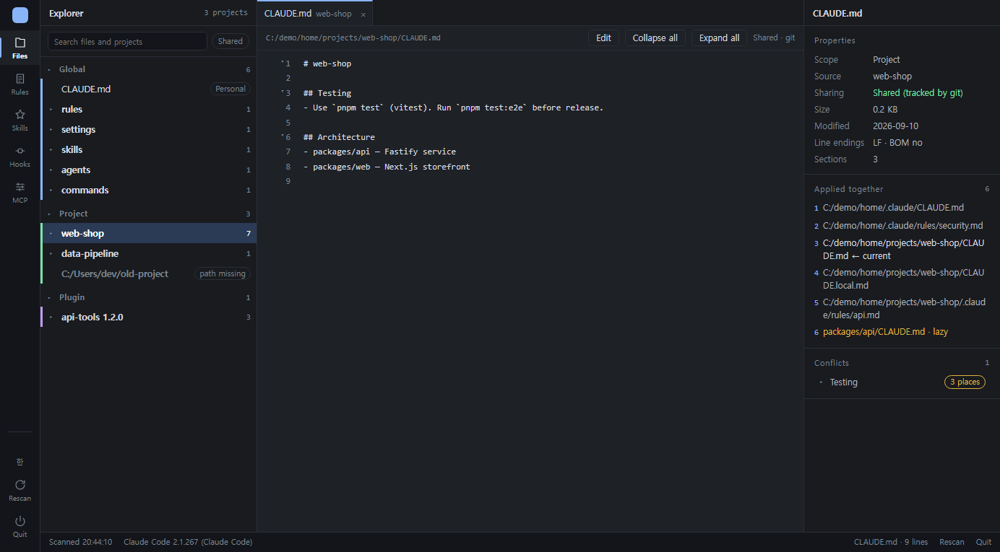
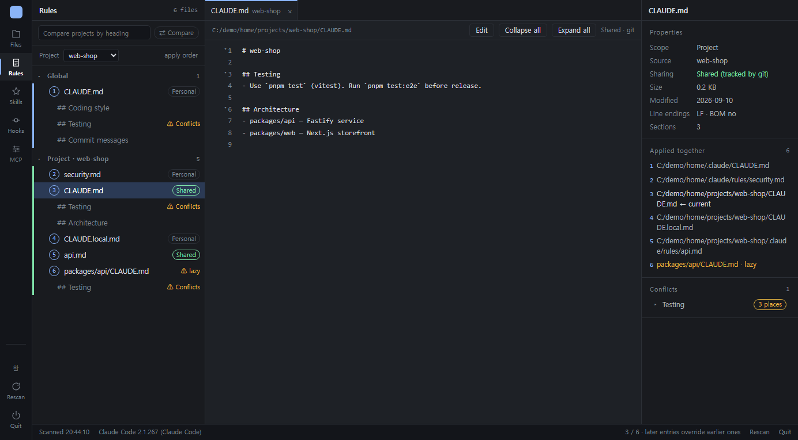
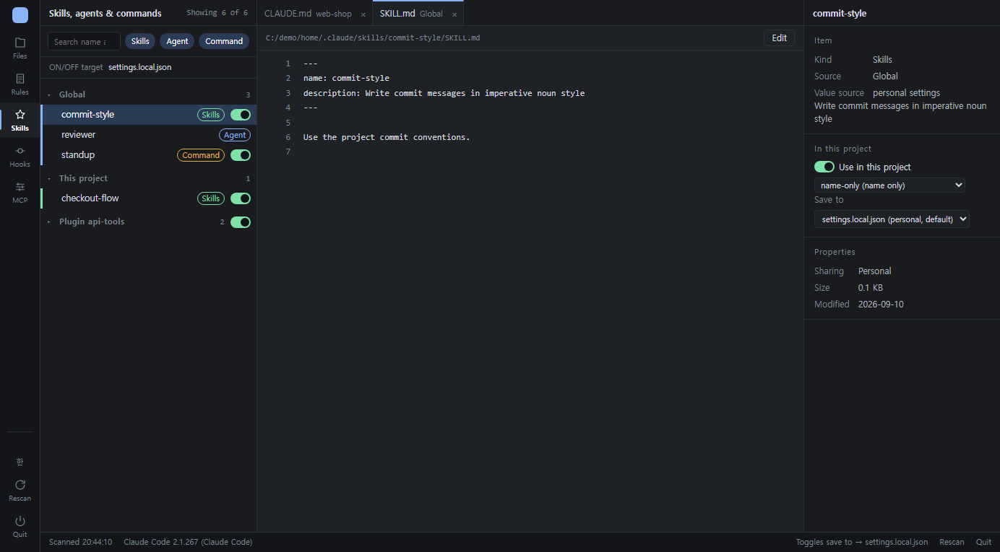
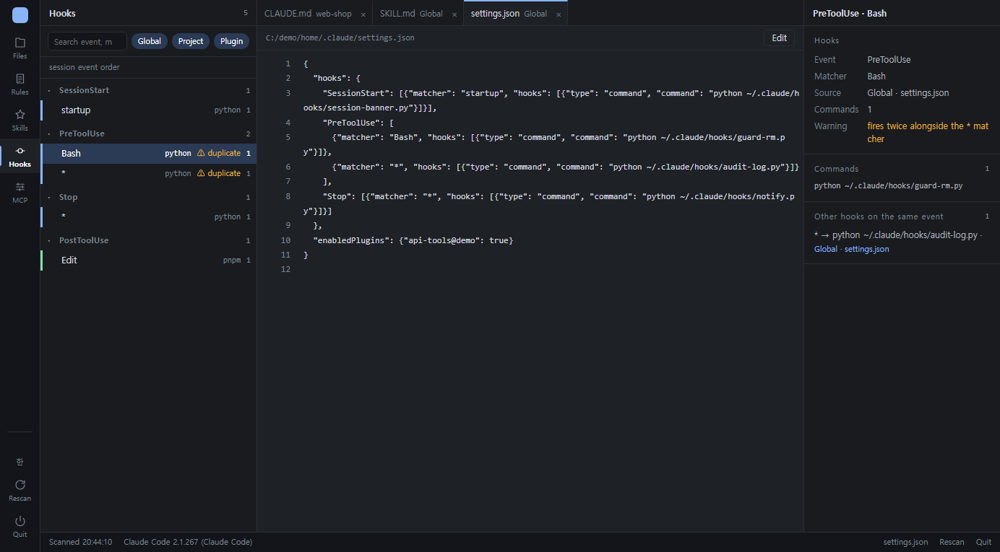
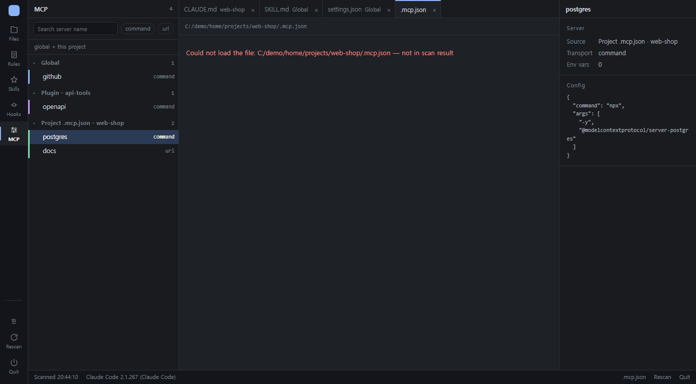
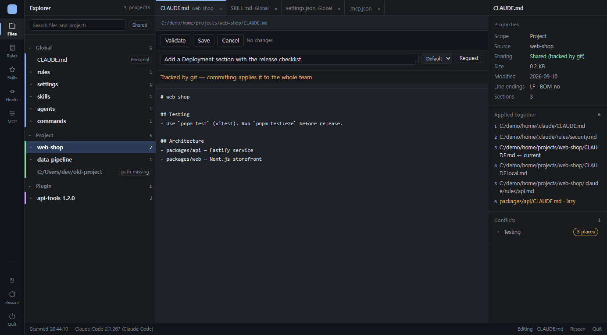
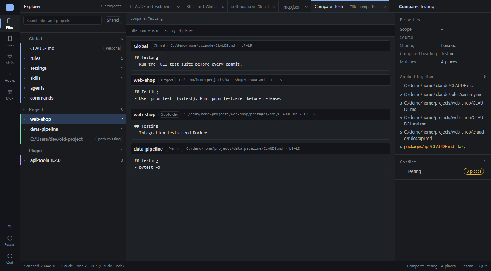

<h1 align="center">claude-config-map</h1>

<p align="center">
  <strong>See every Claude Code setting on your machine in one place, and edit it safely.</strong><br />
  <code>CLAUDE.md</code> · rules · <code>settings.json</code> · skills · agents · commands · hooks · plugins · MCP servers
</p>

<p align="center">
  <strong>Language:</strong>
  <a href="README.md">English</a> |
  <a href="README.ko.md">한국어</a>
</p>

<p align="center">
  <a href="https://github.com/chajunseok/claude-config-map/tags"></a>
  <a href="LICENSE"></a>
  <a href="https://docs.anthropic.com/en/docs/claude-code/plugins"></a>
  <a href="https://github.com/chajunseok/claude-config-map/stargazers"></a>
</p>

<p align="center">
  
  
  
  
  
</p>

<p align="center">
  <a href="#quick-start">Quick start</a> · <a href="#features">Features</a> · <a href="docs/guide.md">Guide</a>
</p>

<p align="center">
  
</p>

## Why

Claude Code reads its configuration from a lot of places: the global `~/.claude/CLAUDE.md` and `rules/`, a `CLAUDE.md` in every project and subfolder, `settings.json` / `settings.local.json`, `.mcp.json`, skill, agent and command folders, and whatever your plugins bring along. Once you have a few projects and plugins, simple questions get hard:

- Which `CLAUDE.md` files actually apply in **this** project, and in what order?
- Where did this hook come from, and does it fire twice?
- Is the same section defined globally **and** in the project?
- Which skills and plugins are on right now, and in which settings file?

**claude-config-map** scans all of it and lays it out IDE-style in your browser, with editing, validation, backups and ON/OFF toggles built in.

## Quick start

> [!IMPORTANT]
> Requires **Python 3.11+** on `PATH`. The plugin does not bundle Python.

In a Claude Code session:

```
/plugin marketplace add chajunseok/claude-config-map
/plugin install config-map@claude-config-map
```

Then, in a **new** session:

```
/config-map
```

Your browser opens at `http://127.0.0.1:8765`. That's it.

<details>
<summary>Run without the plugin</summary>

```bash
git clone https://github.com/chajunseok/claude-config-map.git
cd claude-config-map
python server/web_server.py            # --port 9000, --no-browser
```

</details>

## Features

| | |
|---|---|
| **Effective rule chain**: the `CLAUDE.md` files Claude Code reads in a project, in the order they apply, with `⚠ conflict` when the same section title exists in more than one place. |  |
| **Skill & plugin toggles**: switch skills, commands and whole plugins ON/OFF per project. Writes `skillOverrides` / `enabledPlugins` to the personal or team settings file you pick. |  |
| **Hooks at a glance**: every hook from global, project and plugin settings, grouped by session event, with a warning when a `*` matcher makes one fire twice. |  |
| **MCP servers by source**: global, per-project `.mcp.json` and plugin servers in one list, with the config JSON of each one. |  |
| **Safe editing**: validates before saving (frontmatter, JSON, missing hook scripts, broken `@imports`), refuses to overwrite a file changed on disk, keeps 10 backups per file, preserves CRLF/LF and BOM. Edit one section without touching the rest. |  |
| **Cross-project compare**: put a section with the same title from your global config and every project side by side. |  |

Also included: an optional **edit assistant** that asks your installed `claude` CLI for a revision and shows it as a diff before applying it, a Korean/English UI, and dark and light themes.

## Safe by design

- **Local only.** Binds to `127.0.0.1`, rejects cross-origin requests, and makes no outbound network calls. No telemetry.
- **Zero dependencies.** Python standard library on the server, vanilla JS in the browser, no build step, no CDN.
- **Read-first.** It writes only what you explicitly save or toggle, and backs it up first. The plugin cache is read-only.
- **Edit assistant is opt-in.** It runs `claude -p` with tools disabled, so the document text goes to Anthropic through your own account only when you use it.

Details: [Security](docs/guide.md#security) · [Files this tool reads and writes](docs/guide.md#files-this-tool-reads-and-writes)

## Requirements

- **Python 3.11+** (not bundled; `/config-map` tells you if it is missing)
- **Claude Code** 2.1.199+ recommended (older versions can still view and edit)
- A recent Chrome, Edge or Firefox
- Claude Code CLI login, only for the edit assistant

Tested on Windows 11. macOS and Linux should work but have not been measured yet. Reports are welcome.

## Documentation

The full [guide](docs/guide.md) covers the layout, each sidebar, validation rules (V1–V7), toggle behavior, the HTTP API, troubleshooting and known limits.

## Contributing

Issues and pull requests are welcome. To start:

```bash
python -m unittest discover -s server/tests
CLAUDE_CONFIG_MAP_HOME=/path/to/fixture-home python server/web_server.py --no-browser --port 8802
```

The second command runs against an isolated home so your real config stays untouched. See [Development](docs/guide.md#development) for the project layout and conventions.

If this tool saves you some digging, a ⭐ helps other Claude Code users find it.

<p align="center">
  <a href="https://www.star-history.com/#chajunseok/claude-config-map&Date">
    <picture>
      <source media="(prefers-color-scheme: dark)" srcset="https://api.star-history.com/svg?repos=chajunseok/claude-config-map&type=Date&theme=dark" />
      
    </picture>
  </a>
</p>

## License

[MIT](LICENSE) © junseok.cha
